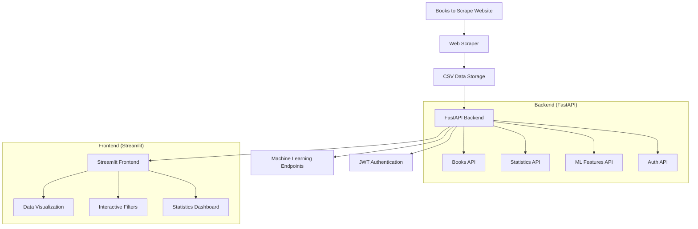

# 📚 Books to Scrape - Sistema Completo

Este projeto é um sistema completo para análise de dados de livros, composto por **Web Scraper**, **API REST** e **Interface Web**. O sistema extrai dados do site [Books to Scrape](https://books.toscrape.com/), oferece uma API robusta para consultas e análises, além de uma interface web interativa.

## 🏗️ Arquitetura do Sistema



### Componentes do Sistema

1. **🕷️ Web Scraper** (`/data`): Extrai dados do site Books to Scrape
2. **🚀 API REST** (`/api`): Backend FastAPI com endpoints completos
3. **💻 Interface Web** (`/client`): Frontend Streamlit para visualização
4. **🤖 Machine Learning**: Endpoints para features e predições
5. **🔐 Autenticação**: Sistema JWT para segurança

## 📋 Funcionalidades

### Web Scraper
- Extração automática de todos os livros
- Navegação inteligente por páginas
- Tratamento de erros robusto
- Dados salvos em CSV

### API REST
- **CRUD completo** para livros
- **Busca e filtros** avançados
- **Estatísticas** detalhadas
- **Machine Learning** endpoints
- **Autenticação JWT**
- **Documentação Swagger** automática

### Interface Web
- Dashboard interativo
- Visualizações gráficas
- Filtros dinâmicos
- Estatísticas em tempo real

## 🚀 Instalação e Configuração

### Pré-requisitos
- Python 3.8+
- pip
- Git

### 1. Clone o Repositório
```bash
git clone <seu-repositorio>
cd fiap-primeirosemestre
```

### 2. Configuração do Web Scraper
```bash
cd data
python -m venv venv
source venv/bin/activate  # Linux/Mac
# ou
venv\Scripts\activate     # Windows
pip install -r requirements.txt
```

### 3. Configuração da API
```bash
cd ../api
python -m venv venv
source venv/bin/activate  # Linux/Mac
# ou
venv\Scripts\activate     # Windows
pip install -r requirements.txt
```

### 4. Configuração do Cliente Web
```bash
cd ../client
python -m venv venv
source venv/bin/activate  # Linux/Mac
# ou
venv\Scripts\activate     # Windows
pip install -r requirements.txt
```

## 🖥️ Endpoints

- Frontend: https://primeirosemestre-client-593831299563.us-central1.run.app/
- Backend: https://primeirosemestre-api-593831299563.us-central1.run.app/
- Swagger UI: https://primeirosemestre-api-593831299563.us-central1.run.app/docs
- Redoc: https://primeirosemestre-api-593831299563.us-central1.run.app/redoc
- OpenAPI JSON: https://primeirosemestre-api-593831299563.us-central1.run.app/openapi.json

## 🏃‍♂️ Execução

### 1. Executar o Web Scraper (Primeira vez)
```bash
cd data
source venv/bin/activate
python books_scraper.py
```

### 2. Executar a API
```bash
cd api
source venv/bin/activate
uvicorn main:app --reload
```
A API estará disponível em: `http://127.0.0.1:8000`

### 3. Executar o Cliente Web
```bash
cd client
source venv/bin/activate
streamlit run streamlit_app.py
```
A interface web estará disponível em: `http://localhost:8501`

## 📖 Documentação da API

### Acesso à Documentação
- **Swagger UI**: `http://127.0.0.1:8000/docs`
- **ReDoc**: `http://127.0.0.1:8000/redoc`
- **OpenAPI JSON**: `http://127.0.0.1:8000/openapi.json`

### Endpoints Principais

#### 🔐 Autenticação
- `POST /api/v1/auth/login` - Login e obtenção de tokens
- `POST /api/v1/auth/refresh` - Renovação de tokens

#### 📚 Livros
- `GET /api/v1/books` - Lista todos os livros
- `GET /api/v1/books/search` - Busca livros por título/categoria
- `GET /api/v1/books/{id}` - Detalhes de um livro específico
- `GET /api/v1/books/top-rated` - Livros mais bem avaliados
- `GET /api/v1/books/price-range` - Filtro por faixa de preço

#### 📂 Categorias
- `GET /api/v1/categories` - Lista todas as categorias

#### 📊 Estatísticas
- `GET /api/v1/stats/overview` - Estatísticas gerais
- `GET /api/v1/stats/categories` - Estatísticas por categoria

#### 🤖 Machine Learning
- `GET /api/v1/ml/features` - Features formatadas para ML
- `GET /api/v1/ml/training-data` - Dataset para treinamento
- `POST /api/v1/ml/predictions` - Predições de rating

#### ⚙️ Sistema
- `GET /api/v1/health` - Status da API

## 🔧 Exemplos de Uso da API

### Autenticação
```bash
# Login
curl -X POST "http://127.0.0.1:8000/api/v1/auth/login" \
  -H "Content-Type: application/json" \
  -d '{
    "username": "usuario",
    "password": "teste"
  }'
```

**Response:**
```json
{
  "access_token": "eyJhbGciOiJIUzI1NiIsInR5cCI6IkpXVCJ9...",
  "refresh_token": "eyJhbGciOiJIUzI1NiIsInR5cCI6IkpXVCJ9...",
  "token_type": "bearer",
  "expires_in": 1800
}
```

### Buscar Livros
```bash
# Buscar por título
curl -X GET "http://127.0.0.1:8000/api/v1/books/search?title=light" \
  -H "Authorization: Bearer <seu_token>"
```

**Response:**
```json
{
  "books": [
    {
      "id": 1,
      "titulo": "A Light in the Attic",
      "preco": 51.77,
      "rating": 3,
      "disponibilidade": "In stock (22 available)",
      "categoria": "Poetry",
      "imagem_url": "https://books.toscrape.com/media/cache/2c/da/..."
    }
  ],
  "total": 1
}
```

### Filtrar por Preço
```bash
# Livros entre £20 e £50
curl -X GET "http://127.0.0.1:8000/api/v1/books/price-range?min=20&max=50" \
  -H "Authorization: Bearer <seu_token>"
```

### Estatísticas Gerais
```bash
curl -X GET "http://127.0.0.1:8000/api/v1/stats/overview" \
  -H "Authorization: Bearer <seu_token>"
```

**Response:**
```json
{
  "total_livros": 1000,
  "preco_medio": 35.24,
  "preco_minimo": 10.00,
  "preco_maximo": 59.99,
  "distribuicao_ratings": {
    "1": 50,
    "2": 100,
    "3": 200,
    "4": 300,
    "5": 350
  },
  "total_categorias": 50
}
```

### Predição de Rating
```bash
curl -X POST "http://127.0.0.1:8000/api/v1/ml/predictions" \
  -H "Content-Type: application/json" \
  -H "Authorization: Bearer <seu_token>" \
  -d '{
    "titulo_length": 45,
    "preco": 29.99,
    "disponibilidade": "In stock",
    "categoria": "Fiction"
  }'
```

**Response:**
```json
{
  "predicted_rating": 4,
  "confidence": 0.75,
  "input_features": {
    "titulo_length": 45,
    "preco": 29.99,
    "disponibilidade": "In stock",
    "categoria": "Fiction",
    "disponibilidade_encoded": 1,
    "categoria_encoded": 15
  }
}
```

## 🐳 Docker

### Executar com Docker
```bash
# API
cd api
docker build -t books-api .
docker run -p 8000:8000 books-api

# Cliente
cd client
docker build -t books-client .
docker run -p 8501:8501 books-client
```

## 📁 Estrutura do Projeto

```
fiap-primeirosemestre/
├── README.md
├── cloudbuild.yaml
├── data/
│   ├── requirements.txt
│   ├── books_scraper.py
│   └── books_data.csv
├── api/
│   ├── main.py              # FastAPI app
│   ├── models.py            # Pydantic models
│   ├── data_service.py      # Data access layer
│   ├── auth_service.py      # JWT authentication
│   ├── requirements.txt
│   └── Dockerfile
└── client/
    ├── streamlit_app.py     # Streamlit interface
    ├── requirements.txt
    └── Dockerfile
```

## 🔑 Credenciais Padrão

- **Username**: `usuario`
- **Password**: `teste`

## 🛠️ Tecnologias Utilizadas

### Backend
- **FastAPI**: Framework web moderno e rápido
- **Pydantic**: Validação de dados
- **PyJWT**: Autenticação JWT
- **Uvicorn**: Servidor ASGI

### Frontend
- **Streamlit**: Interface web interativa
- **Pandas**: Manipulação de dados
- **Plotly**: Visualizações gráficas

### Web Scraping
- **Requests**: Requisições HTTP
- **BeautifulSoup**: Parsing HTML
- **CSV**: Armazenamento de dados

## 👨‍💻 Autor

**Fellipe Medeiros**
- Email: fellipe.medeiros1@gmail.com
- FIAP - Primeiro Semestre
